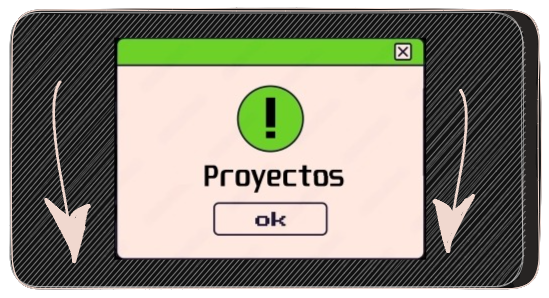
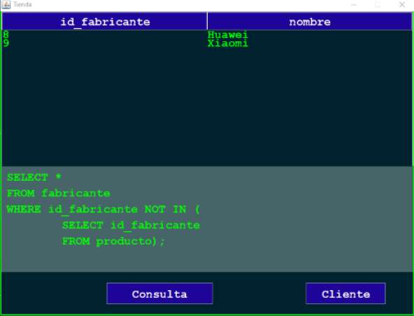
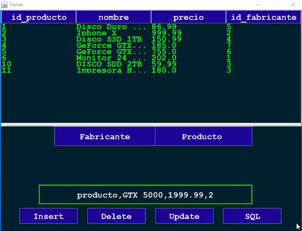
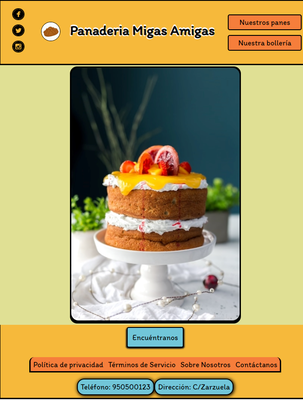

    

# Proyectos de Empresa

 

 

# Proyectos del Grado Superior

## Juego - Tetris (JavaScript) - 2DAW
 

## Juego - Tragaperras (Java Swing) - 1DAW
 

## Interfaz SQL con Java Swing - 1DAW

  

## Juego - Conecta 4 (Java Swing) - 1DAW

# WEB

