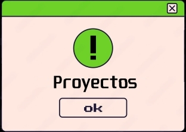
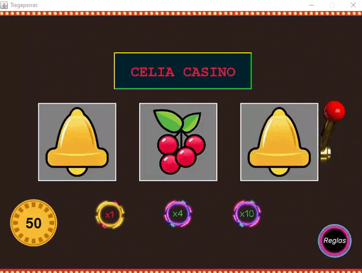
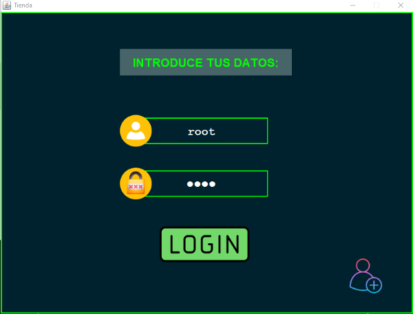
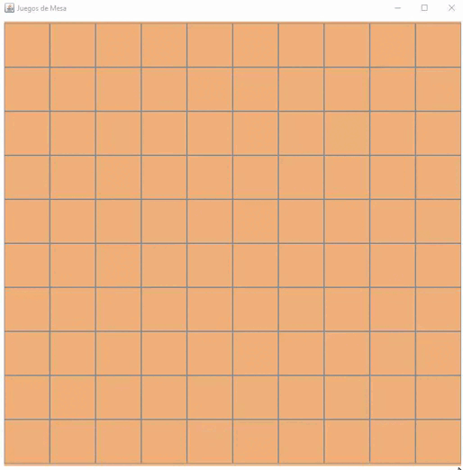

   

    

## Tragaperras
### Pequeño proyecto de 1DAW simulando una app tragaperras. Haz click en la imagen para acceder:

## Mini-SQL
### Proyecto final de programación en 1DAW. CRUD. Haz click en la imagen para acceder:

## Conecta 4
### Proyecto de semana santa de 1DAW del mítico juego "Conecta a 4". Haz click en la imagen para acceder:

